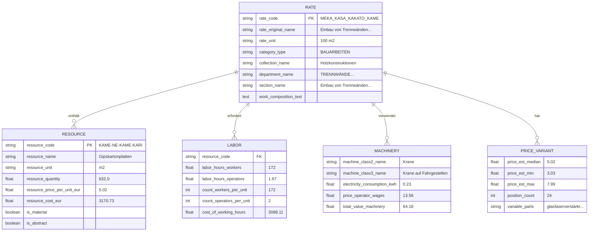
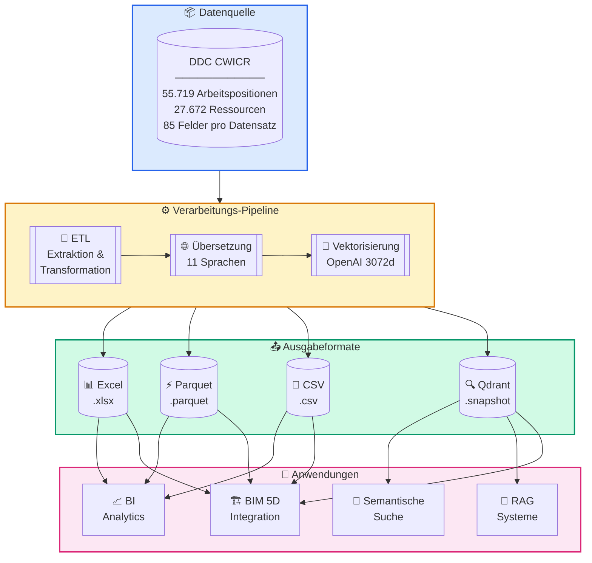
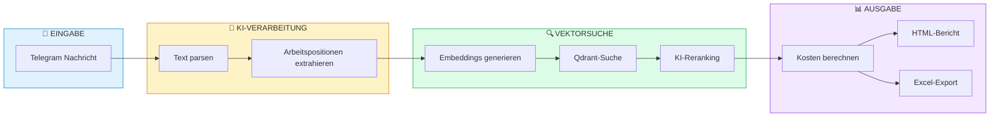
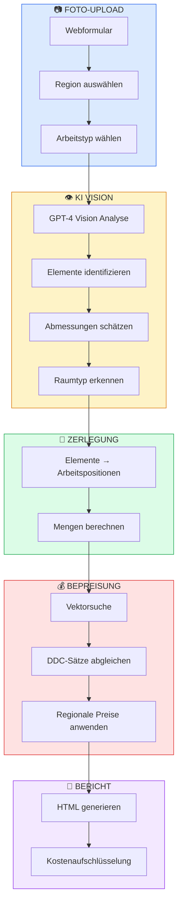
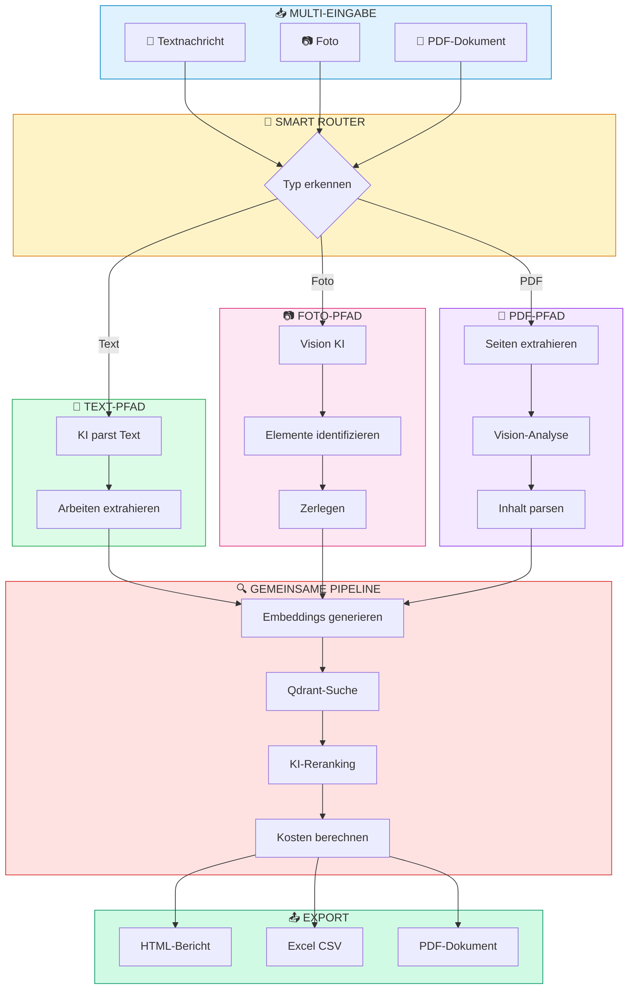
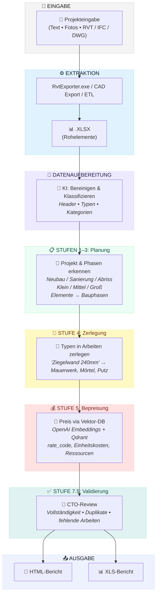

<h3 align="center">DDC CWICR - Construction Work Items, Components & Resources </br>
  + Pipelines n8n zur Berechnung von Kostenvoranschlägen basierend auf Beschreibungen, Fotos und CAD (BIM)</h3>

<p align="center">
  <a href="README.md">🇬🇧 English</a> •
  <a href="README.zh-CN.md">🇨🇳 中文</a> •
  <a href="README.es.md">🇪🇸 Español</a> •
  <a href="README.pt-BR.md">🇧🇷 Português</a> •
  <a href="README.ru.md">🇷🇺 Русский</a> •
  <a href="README.ja.md">🇯🇵 日本語</a> •
  <a href="README.de.md"><b>🇩🇪 Deutsch</b></a> •
  <a href="README.fr.md">🇫🇷 Français</a>
</p>

<p align="center">
  
</p>

<div align="center">
  
  
  
  
</div>

<div align="center">
  
  
  
  
  
</div>

<p align="center">
  
</p>

<h3 align="center">⚡ n8n Workflows</h3>
<p align="center"><code>Wählen Sie Ihre Eingabe → Erhalten Sie eine Kostenschätzung</code></p>

<br>

<table width="100%">
<tr>

<td align="center" valign="top" width="33%">
<br>
<h3>📝 Text</h3>
<p>Schnelle Umwandlung von Leistungsumfang<br>aus einer kurzen Beschreibung</p>
<p><b>Eingabe:</b> Telegram / Chat-Nachricht<br>
<b>Ausgabe:</b> Abgeglichene Arbeitspositionen + Schätzung</p>
<br>
<a href="#1️⃣-text-schätzer-bot">📖 Dokumentation</a>
<br><br>
<a href="./n8n_1_Telegram_Bot_Cost_Estimates_and_Rate_Finder_TEXT_DDC_CWICR.json">

</a>
<br><br>
</td>

<td align="center" valign="top" width="33%">
<br>
<h3>📷 Foto / PDF</h3>
<p>Baustellenfotos, gescannte LV,<br>Foto-PDFs vom Feld</p>
<p><b>Eingabe:</b> Bild oder PDF-Seiten<br>
<b>Ausgabe:</b> Extrahierter Umfang → Schätzung</p>
<br>
<a href="#2️⃣-foto-kostenschätzer">📖 Foto Doku</a> · <a href="#3️⃣-universal-bot-text--foto--pdf">📖 Universal Bot</a>
<br><br>
<a href="./n8n_2_Photo_Cost_Estimate_DDC_CWICR.json">

</a>
&nbsp;
<a href="./n8n_3_Telegram_Bot_Cost_Estimates_and_Rate_Finder_TEXT_PHOTO_PDF_DDC_CWICR.json">

</a>
<br><br>
</td>

<td align="center" valign="top" width="33%">
<br>
<h3>🧊 CAD / BIM</h3>
<p>Revit / IFC / DWG-basierte<br>Mengenermittlung & Kalkulation</p>
<p><b>Eingabe:</b> Modell-Export <br>
<b>Ausgabe:</b> 4D/5D-Schätzung + Aufschlüsselung</p>
<br>
<a href="#4️⃣-cad-bim-kostenschätzungs-pipeline">📖 Dokumentation</a>
<br><br>
<a href="./n8n_4_CAD_(BIM)_Cost_Estimation_Pipeline_4D_5D_with_DDC_CWICR.json">

</a>
<br><br>
</td>

</tr>
</table>

<br>
<p align="center">
  <a href="https://openconstructionestimate.com">
    
  </a>
</p>
<br>
<p align="center">
 DataDrivenConstruction Kunden und Nutzer
  <br>
  <a href="https://datadrivenconstruction.io/">
  
  </a>
  <br></br>
</p>


---

## 📑 Inhaltsverzeichnis

### 🤖 KI-Integration
- [Perfekter Treibstoff für KI](#-perfekter-treibstoff-für-ihre-ki-produkte) — Warum diese Datenbank ideal für KI ist
- [Claude Code & Google Antigravity](#-claude-code--google-antigravity--ki-programmierassistenten) — KI-Programmierassistenten
- [n8n](#-n8n--visuelle-workflow-automatisierung) — Workflow-Automatisierung
- [Dify](#-dify--llm-anwendungen-erstellen) — LLM-App-Entwicklung
- [Sim AI & Andere](#-sim-ai--ähnliche-plattformen) — Kompatible Plattformen
- [Universelle Anwendungsfälle](#-universelle-anwendungsfälle) — Was Sie erstellen können

### 📊 Datenbank & Daten
- [Überblick](#überblick) — Was ist DDC CWICR
- [Verfügbare Formate](#verfügbare-formate) — Excel, Parquet, CSV, Qdrant
- [Datenschema](#datenschema) — 85-Felder-Struktur
- [Feldgruppen](#feldgruppen) — Klassifikation, Ressourcen, Arbeit, Maschinen
- [Methodik](#methodik) — Ressourcenbasierte Kalkulationsprinzipien
- [Historischer Kontext](#historischer-kontext) — 100+ Jahre Standards

### ⚡ n8n Workflows
- [n8n Workflows Übersicht](#-n8n-workflows) — Wählen Sie Ihren Eingabetyp
- [Jetzt testen — Live Demo Bots](#-jetzt-testen--live-demo-bots) — Sofort in Telegram testen
- [Workflow 1: Text-Schätzer-Bot](#1️⃣-text-schätzer-bot) — Telegram-Bot für Texteingabe
- [Workflow 2: Foto-Kostenschätzer](#2️⃣-foto-kostenschätzer) — Webformular mit KI-Vision
- [Workflow 3: Universal Bot](#3️⃣-universal-bot-text--foto--pdf) — Text + Foto + PDF
- [Workflow 4: CAD/BIM Pipeline](#4️⃣-cad-bim-kostenschätzungs-pipeline) — Revit/IFC/DWG zur Schätzung
- [Workflows Schnellstart](#workflows-schnellstart) — Einrichtung in 4 Schritten
- [n8n 2.0+ Einrichtung](#️-n8n-20-einrichtung-erforderlich) — Execute Command Node aktivieren

### 🏗️ CAD/BIM Pipeline
- [Voraussetzungen](#-voraussetzungen) — Erforderliche Komponenten
- [Pipeline-Stufen](#-pipeline-stufen) — 10-stufige Verarbeitung
- [LLM-Modellauswahl](#️-llm-modellauswahl) — OpenAI, Claude, Gemini, Grok
- [Ausgabedateien](#-ausgabedateien) — HTML & Excel-Berichte
- [Fehlerbehebung](#️-fehlerbehebung) — Häufige Probleme

### 🔍 Vektordatenbank
- [Vektordatenbank](#vektordatenbank) — Semantische Suche mit Qdrant
- [Qdrant-Snapshots der Vektordatenbank](#qdrant-snapshots-der-vektordatenbank) — Snapshots herunterladen
- [Collections](#collections) — 11 Sprach-Collections
- [Docker-Bereitstellung](#docker-bereitstellung) — Selbst gehostete Einrichtung

### 🌐 API
- [Pricing Search API](#-pricing-search-api--buildcalculatorio) — Kostenlose REST-API für Baupreise
- [API-Endpunkte](#api-endpunkte) — Suche, Sprachen, Statistiken
- [Codebeispiele](#api-codebeispiele) — cURL, Python, JavaScript

### 🚀 Erste Schritte
- [Schnellstart - Python](#schnellstart) — Tabellarische Daten & semantische Suche
- [Integrationsanwendungsfälle](#integration) — Einstieg bis Fortgeschritten

### 👥 Community
- [Ressourcen & Community](#ressourcen--community) — Links & Kanäle
- [Beratung & Schulung](#beratung--schulung) — Professionelle Dienstleistungen
- [Mitwirken](#mitwirken) — Workflows einreichen
- [Lizenz](#lizenz) — CC BY 4.0 & MIT
- [Projekt unterstützen](#projekt-unterstützen) — Sponsern & Spenden
- [🤖 AI Instructions](#ai-instructions) — Dokumentation für KI-Assistenten


---

## 🚀 Perfekter Treibstoff für Ihre KI-Produkte

<p align="center">
  <b>Klonen Sie einfach das Repository und beschreiben Sie, was Sie wollen — die KI erledigt den Rest</b>
</p>

DDC CWICR ist nicht nur eine Datenbank — es ist **sofort einsatzbereiter Treibstoff für KI-gestützte Anwendungen**. Ob Sie Kostenschätzungs-Bots erstellen, Bau-Workflows automatisieren oder intelligente Assistenten entwickeln — diese Daten funktionieren sofort mit modernen KI-Tools.

### Warum diese Datenbank ideal für KI ist

| Merkmal | Vorteil |
|---------|---------|
| **Vorberechnete Embeddings** | Keine Vektorgenerierung nötig — semantische Suche funktioniert sofort |
| **Strukturiertes 85-Felder-Schema** | KI kann Datenbeziehungen verstehen und genaue Antworten liefern |
| **11 Sprachen inklusive** | Mehrsprachige Anwendungen ohne Übersetzungsaufwand erstellen |
| **55.000+ Arbeitspositionen** | Umfassende Abdeckung für jede Baukalkulationsaufgabe |
| **Ressourcenbasierte Methodik** | Transparente Daten, die KI erklären und aufschlüsseln kann |

### 📋 Fertige Arbeitsbeschreibungen für jedes System

<p align="center">
  
</p>

DDC CWICR bietet **vollständige, strukturierte Arbeitsbeschreibungen**, die in jedem System oder Format angezeigt werden können. Jede Arbeitsposition enthält alle Informationen, die verschiedene Projektbeteiligte benötigen:

| Beteiligter | Was er bekommt |
|-------------|----------------|
| 🏢 **Auftraggeber / Investor** | Volle Kostentransparenz, Ressourcenaufschlüsselung, Preisbegründung für Investitionsentscheidungen |
| 📊 **Kalkulator** | Detaillierte Preise, Arbeitsstunden, Materialmengen, Gerätekosten — fertig für die LV-Erstellung |
| 👷 **Bauleiter / Polier** | Arbeitszusammensetzung, Ressourcenbedarf, Arbeitsnormen für tägliche Planung und Ausführung |
| 🔧 **Auftragnehmer / Ausführender** | Vollständige Spezifikationen, Einheitspreise, Produktivitätskennzahlen für genaue Angebote und Terminplanung |

Export nach **Excel, PDF, HTML, ERP-Systeme, BIM-Plattformen** — das strukturierte 85-Felder-Schema gewährleistet Datenintegrität in allen Ausgabeformaten.

### 🛠️ Funktioniert perfekt mit

<table>
<tr>
<td align="center" width="20%">
<br/>
<b>Claude Code</b><br/>
<sub>KI-Programmierassistent CLI</sub>
</td>
<td align="center" width="20%">
<br/>
<b>Google Antigravity</b><br/>
<sub>Google Antigravity</sub>
</td>
<td align="center" width="20%">
<br/>
<b>n8n</b><br/>
<sub>Workflow-Automatisierung</sub>
</td>
<td align="center" width="20%">
<br/>
<b>Dify</b><br/>
<sub>LLM-App-Entwicklung</sub>
</td>
<td align="center" width="20%">
<br/>
<b>Sim AI & Andere</b><br/>
<sub>KI-Plattformen</sub>
</td>
</tr>
</table>

---

## 🎯 DDC Skills — 196 Einsatzbereite KI-Automatisierungen

> **Neu!** [DDC Skills für KI-Agenten im Bauwesen](https://github.com/datadrivenconstruction/DDC_Skills_for_AI_Agents_in_Construction) — ein komplettes Automatisierungs-Toolkit für Bauunternehmen.

<p align="center">
  <a href="https://github.com/datadrivenconstruction/DDC_Skills_for_AI_Agents_in_Construction">
    
  </a>
</p>

### So funktioniert es

```
1. Skills-Repository klonen
2. Mit Claude Code, Cursor oder GitHub Copilot öffnen
3. Beschreiben Sie, was Sie automatisieren möchten — KI führt Sie Schritt für Schritt
```

### Zeitersparnis

| Prozess | Vorher | Nachher | Reduzierung |
|---------|--------|---------|-------------|
| Preisrecherche | 15 Min | 10 Sek | 99% |
| Tagesberichte | Manuell | Automatisiert | 92% |
| Kostenschätzungen | Stunden | Minuten | 87% |
| Budgetverfolgung | Tabellen | Echtzeit | 87% |

### Enthaltene Inhalte

| Ordner | Skills | Beschreibung |
|--------|--------|--------------|
| **DDC Toolkit** | 85 | Produktionswerkzeuge inkl. CWICR-Datenbankintegration |
| **DDC Book** | 50 | Skills basierend auf Data-Driven Construction Methodik |
| **DDC Insights** | 5 | n8n-Workflow-Vorlagen |
| **DDC Curated** | 5 | Externe Integrations-Skills |
| **DDC Innovative** | 22 | Erweiterte KI/ML-Fähigkeiten |

Das Skills-Repository bietet **direkte Integration mit dieser CWICR-Datenbank** — semantische Suche, automatische Kostenberechnungen, Tagesberichte, Fehlererkennung und mehr.

**→ [DDC Skills entdecken](https://github.com/datadrivenconstruction/DDC_Skills_for_AI_Agents_in_Construction)**

---

### 💻 Claude Code & Google Antigravity — KI-Programmierassistenten

Der schnellste Weg, mit DDC CWICR zu arbeiten. Öffnen Sie einfach das Repository in Claude Code oder Google Antigravity und stellen Sie Fragen in natürlicher Sprache.

**Erste Schritte:**
```bash
# Repository klonen
git clone https://github.com/datadrivenconstruction/OpenConstructionEstimate-DDC-CWICR.git

# Mit Claude Code öffnen
cd OpenConstructionEstimate-DDC-CWICR
claude
```

**Beispiel-Prompts:**

| Aufgabe | Prompt |
|---------|--------|
| **Daten erkunden** | "Zeige mir die Struktur dieser Baukostendatenbank und erkläre, welche Daten verfügbar sind" |
| **Arbeitspositionen finden** | "Finde alle Arbeitspositionen zu Betonfundamenten und zeige ihre Kosten" |
| **Abfragen erstellen** | "Schreibe ein Python-Skript zur Suche von Sanitärarbeiten mit Arbeitsstunden > 100" |
| **Berichte erstellen** | "Erstelle einen Kostenaufschlüsselungsbericht für Wohnungssanierungsarbeiten" |
| **Kosten analysieren** | "Vergleiche Materialkosten zwischen verschiedenen Wandbaumethoden" |
| **Integrationen erstellen** | "Erstelle ein Skript, das sich mit der Qdrant-Datenbank verbindet und semantische Suche durchführt" |

**Profi-Tipps:**
- Verweisen Sie Claude auf bestimmte Dateien: *"Analysiere die Parquet-Datei und fasse die Kostenverteilung zusammen"*
- Fragen Sie nach Erklärungen: *"Erkläre, wie die ressourcenbasierte Kalkulationsmethodik in dieser Datenbank funktioniert"*
- Fordern Sie Änderungen an: *"Modifiziere den n8n-Workflow, um E-Mail-Benachrichtigungen hinzuzufügen"*

---

### ⚡ n8n — Visuelle Workflow-Automatisierung

Erstellen Sie leistungsstarke Automatisierungs-Pipelines ohne Programmierung. Verbinden Sie DDC CWICR mit über 400 Apps und Diensten.

**Anwendungsfälle:**

| Workflow | Beschreibung |
|----------|--------------|
| **Telegram-Bot** | Benutzer senden Text/Foto → KI extrahiert Arbeitspositionen → Gibt Kostenschätzung zurück |
| **E-Mail-Automatisierung** | LV per E-Mail empfangen → Mit KI verarbeiten → Formatierte Schätzung senden |
| **CRM-Integration** | Neues Projekt im CRM → Auto-Generierung einer vorläufigen Schätzung → Deal-Wert aktualisieren |
| **BIM-Pipeline** | Export aus Revit → Mengen extrahieren → Mit DDC-Sätzen abgleichen → 5D-Bericht erstellen |
| **Slack-Bot** | Team stellt Fragen → KI durchsucht Datenbank → Gibt relevante Arbeitspositionen zurück |

**Schnellstart:**
1. Workflow-JSON aus diesem Repository herunterladen
2. In n8n importieren: `Workflows → Import → From File`
3. Zugangsdaten konfigurieren (OpenAI, Qdrant, Telegram)
4. Aktivieren und testen

Siehe Abschnitt [n8n Workflows](#n8n-workflows--detaillierte-beschreibung) für detaillierte Einrichtung.

---

### 🤖 Dify — LLM-Anwendungen erstellen

Erstellen Sie benutzerdefinierte KI-Anwendungen mit DDC CWICR als Wissensbasis.

**Einrichtung:**
1. Neue Dify-Anwendung erstellen
2. Wissensbasis hinzufügen → Parquet/CSV-Dateien hochladen oder mit Qdrant verbinden
3. RAG-Pipeline mit Embeddings konfigurieren
4. Chat-Oberfläche oder API erstellen

**Anwendungsideen:**

| App-Typ | Beschreibung |
|---------|--------------|
| **Baukalkulator-Chatbot** | Konversationsschnittstelle für Kostenabfragen |
| **Arbeitspositionen-Suche** | Natürlichsprachige Suche über 55.000+ Positionen |
| **Kostenberater** | KI, die Kostenaufschlüsselungen erklärt und Optimierungen vorschlägt |
| **Mehrsprachiger Assistent** | Automatische Spracherkennung und Antwort in Benutzersprache |
| **API-Endpunkt** | REST-API für Integration mit anderen Systemen |

**Beispiel Dify-Prompt-Vorlage:**
```
Sie sind ein Baukostenschätzungsassistent mit Zugriff auf die DDC CWICR Datenbank.

Kontext: {{context}}

Benutzerfrage: {{query}}

Liefern Sie genaue Kosteninformationen basierend auf der Datenbank. Einschließlich:
- Relevante Arbeitspositionen mit Codes
- Einheitskosten und Mengen
- Ressourcenaufschlüsselung (Arbeit, Material, Ausrüstung)
- Gesamtkostenberechnung
```

---

### 🔮 Sim AI & Ähnliche Plattformen

DDC CWICR integriert sich mit jeder KI-Plattform, die unterstützt:
- **Vektordatenbanken** (Qdrant, Pinecone, Weaviate, Milvus)
- **Strukturierte Daten** (CSV, Parquet, Excel)
- **OpenAI Embeddings** (text-embedding-3-large, 3072 Dimensionen)

**Kompatible Plattformen:**
- **Sim AI** — KI-Simulation und Modellierung
- **LangChain / LlamaIndex** — LLM-Anwendungsframeworks
- **Flowise** — Low-Code LLM-App-Builder
- **Botpress** — Konversations-KI-Plattform
- **Voiceflow** — Sprach- und Chat-Design
- **Stack AI** — No-Code KI-Workflows
- **Relevance AI** — KI-Workforce-Plattform

**Universelles Integrationsmuster:**

```python
# Funktioniert mit jeder Plattform, die Qdrant unterstützt
from qdrant_client import QdrantClient

# Mit DDC CWICR verbinden
client = QdrantClient("ihre-qdrant-instanz", port=6333)

# Semantische Suche
results = client.search(
    collection_name="ddc_de_berlin",  # oder ddc_en_toronto, ddc_ru_stpetersburg, ddc_zh_shanghai, etc.
    query_vector=ihr_embedding,
    limit=10
)

# Ergebnisse in Ihrer KI-Anwendung verwenden
for item in results:
    print(f"{item.payload['rate_code']}: {item.payload['rate_original_name']}")
```

---

### 📋 Universelle Anwendungsfälle

Unabhängig davon, welches KI-Tool Sie wählen, ermöglicht DDC CWICR:

| Anwendungsfall | Beschreibung |
|----------------|--------------|
| **Sofortige Kostenschätzung** | Baukosten aus Textbeschreibungen oder Fotos erhalten |
| **LV-Generierung** | Automatische Erstellung von Leistungsverzeichnissen aus Projektbeschreibungen |
| **Preisbenchmarking** | Kosten über Regionen und Sprachen vergleichen |
| **Ressourcenplanung** | Arbeitsstunden, Materialien und Ausrüstungsbedarf berechnen |
| **Investitionsanalyse** | Tiefgehende Kostenprüfungen mit voller Ressourcentransparenz |
| **Mehrsprachige Unterstützung** | Benutzer in 11 Sprachen mit lokalisierten Preisen bedienen |
| **BIM-Integration** | Verbindung zu Revit/IFC für automatisierte 4D/5D-Kalkulation |
| **KI-Modelle trainieren** | Strukturierte Daten für Feinabstimmung von Bau-KI verwenden |

---

## Überblick

**DDC CWICR** (Construction Work Items, Components & Resources) ist eine offene Datenbank für Baukostenkalkulation, die das gesamte Spektrum der Bautätigkeiten abdeckt - von Erdarbeiten und Betoneinbau bis hin zu spezialisierten Installationsarbeiten.

Die Datenbank basiert auf Quellen, die moderne Baupraxis in Eurasien und dem asiatisch-pazifischen Raum beschreiben, wo ein einheitliches technisches Standardisierungsökosystem als gemeinsame Ingenieursprache für mehr als zehn dynamisch wachsende Volkswirtschaften dient. DDC CWICR stellt einen Versuch dar, offene Standards zu harmonisieren, indem ein einheitlicher regulatorischer Rahmen für das Kapitalprojektmanagement in mehreren Sprachen etabliert wird.

<p align="center">
  <br>
  
  <br></br>
</p>

Die strukturierten Daten können über tabellarische Formate (XLSX, CSV, Parquet) abgerufen oder über LLM konversationell abgefragt werden, was es Fachleuten ermöglicht, Bauwerksbeschreibungen (QDRANT Vektordatenbank) in automatisierte Pipelines und Workflows mittels natürlicher Sprache oder präziser Abfragen zu integrieren.

### Verfügbare Formate

| Format      | Erweiterung | Größe        | Ideal für                             | Funktionen                           |
|-------------|-------------|--------------|---------------------------------------|--------------------------------------|
| **Excel**   | `.xlsx`     | ~150–400 MB  | Manuelle Analyse, Filterung, Pivots   | Menschenlesbar, volle Formatierung   |
| **Parquet** | `.parquet`  | ~55 MB       | ETL-Pipelines, ML-Training, Big Data  | Spaltenbasiert, exzellente Komprimierung |
| **CSV**     | `.csv`      | ~1,3 GB      | Datenbankimport, Legacy-Systeme       | Universelle Kompatibilität           |
| **Qdrant**  | `.snapshot` | ~1 GB        | Semantische Suche, RAG, KI-Assistenten| Vorberechnete OpenAI Embeddings      |


Eine Live-Demo ist unter [openconstructionestimate.com](https://openconstructionestimate.com/) verfügbar, wo Sie die Daten erkunden und die Vektordatenbank für semantische Suche in Aktion sehen können.

<p align="center">
  
</p>

---

## Datenschema

Die Datenbank enthält **85 Felder**, die in logische Gruppen organisiert sind. Jeder Datensatz repräsentiert entweder eine Arbeitsposition (Satz) oder eine Ressource mit vollständiger Kostenaufschlüsselung.



### Feldgruppen
Die 85 Datenbankfelder sind in logische Gruppen organisiert, die die ressourcenbasierte Kalkulationsmethodik widerspiegeln. Jede Gruppe erfüllt eine spezifische Funktion in der Kostenaufschlüsselungsstruktur: von hierarchischer Klassifikation und Arbeitspositionsidentifikation bis hin zu detailliertem Ressourcenverbrauch, Arbeitsanforderungen, Maschinenkosten und aggregierten Summen. Diese modulare Struktur ermöglicht es Benutzern, nur die relevanten Felder für ihre Aufgabe abzufragen - ob bei der Erstellung einer Materialliste, Analyse der Arbeitsproduktivität oder Erstellung einer vollständigen Kostenschätzung.

<p align="center">
  <br>
  
  <br></br>
</p>

**Klassifikation** - `category_type`, `collection_code`, `collection_name`, `department_code`, `department_name`, `department_type`, `section_name`, `section_type`, `subsection_code`, `subsection_name`

**Arbeitsposition (Satz)** - `rate_code`, `rate_original_name`, `rate_final_name`, `rate_unit`, `row_type`, `is_scope`, `is_abstract`, `is_machine`, `is_labor`, `is_material`, `work_composition_text`

**Ressourcen** - `resource_code`, `resource_name`, `resource_unit`, `resource_quantity`, `parameter_resource_quantity`, `resource_price_per_unit_eur_current`, `resource_cost_eur`

**Arbeit** - `count_workers_per_unit`, `count_engineers_per_unit`, `count_operators_per_unit`, `count_total_people_per_unit`, `labor_hours_construction_workers`, `labor_hours_operators`, `labor_hours_engineers`, `total_labor_hours_workers_operators`, `total_labor_hours_all_personnel`, `cost_of_working_hours`, `count_people_per_day`

**Maschinen** - `machine_class2_name`, `machine_class3_name`, `personnel_operator_code`, `personnel_operator_grade`, `price_operator_wages`, `price_relocation_included`, `price_cost_without_wages`, `electricity_consumption_kwh_per_machine_hour`, `electricity_cost_per_unit`, `electricity_cost_total_sum`, `cost_operator_sum`, `total_value_machinery_equipment`

**Preisvarianten** - `price_code_prefix`, `price_abstract_resource_common_start`, `price_abstract_resource_variable_parts`, `price_abstract_resource_position_count`, `price_abstract_resource_est_price_min`, `price_abstract_resource_est_price_max`, `price_abstract_resource_est_price_mean`, `price_abstract_resource_est_price_median`, `price_abstract_resource_unit`, `abstract_resource_tech_group`

**Aggregate** - `total_cost_per_position`, `total_material_cost_per_position`, `total_resource_cost_per_position`, `total_value_abstract_resources`, `materials_resource_cost_eur`

**Masse & Services** - `mass_name`, `mass_value`, `mass_unit`, `service_category`, `service_type`, `parameter_service_code`, `parameter_service_unit`, `parameter_service_name`, `parameter_service_quantity`, `service_cost_sum`

### Kostenberechnungsformel

| Komponente        | Technologie-Norm | ×   | Regionaler Preis | =   | Kosten                   |
|-------------------|------------------|-----|------------------|-----|--------------------------|
| 👷 **Arbeit**     | 172 Std/100m²    | ×   | €17,95/Std       | =   | €3.088,11                |
| 🧱 **Materialien**| 632 m²/100m²     | ×   | €5,02/m²         | =   | €3.170,73                |
| 🚜 **Ausrüstung** | 1,67 Std/100m²   | ×   | €38,42/Std       | =   | €64,18                   |
|                   |                  |     | **Gesamt**       | =   | **€7.725,91 pro 100m²**  |

---

## Methodik

Der Hauptwert der **ressourcenbasierten Kalkulation** ist die Trennung der unveränderlichen Produktionstechnologie von der volatilen finanziellen Komponente. Sie basiert auf den physikalischen "Grundprinzipien" des Bauens:
- Erforderliche Arbeitsstunden für spezifische Arbeiten
- Materialmengen pro Arbeitseinheit
- Benötigte Gerätezeit

**Warum das wichtig ist:**

- **Transparenz** - Preisgestaltung ohne versteckte Aufschläge, vollständige Ressourcenaufschlüsselung
- **Prüfbarkeit** - Tiefgehende Analysefähigkeit für Investitionsanalyse und Verifizierung
- **Übertragbarkeit** - Regionsunabhängige Normen, anwendbar über Märkte hinweg
- **Bewährt** - Industriestandard-Methodik, etabliert über 100+ Jahre




### Historischer Kontext

Die Bauwerksbeschreibungen in dieser Datenbank basieren auf einer ressourcenbasierten Standardisierungsmethodik mit Wurzeln, die von den Produktionsnormen des frühen 20. Jahrhunderts bis zu den heutigen digitalen Referenzsystemen reichen. Dieser seit den 1920er Jahren kontinuierlich entwickelte und verfeinerte Ansatz hat eine besonders robuste Evolution im eurasischen Raum erfahren.

Während hundert Jahren der Entwicklung hat das System den Übergang von manuellen Berechnungen zu maschinenlesbaren Formaten vollzogen - doch sein grundlegendes Prinzip bleibt intakt: die präzise Messung der physischen Ressourcen, die pro Einheit der Bauleistung erforderlich sind. Moderne Implementierungen verbinden historische normative Daten mit Echtzeit-Marktpreisen.

Regionale Adaptationen dieser Methodik operieren unter verschiedenen nationalen Bezeichnungen: ENIR, GESN, FER, NRR, ESN, AzDTN, ShNQK, MKS ChT, SNT, BNbD, Dinh Muc, Ding'e.

<p align="center">
  
</p>

⭐ <b>Wenn Sie neue Updates und Datenbankversionen sehen möchten und unsere Tools nützlich finden, geben Sie unseren Repositories bitte einen Stern, um mehr ähnliche Anwendungen für die Bauindustrie zu sehen.</b>
Bewerten Sie den DDC-Workflow auf GitHub mit einem Stern und werden Sie sofort über neue Releases benachrichtigt.
<p align="center">
  <br>
  
  <br></br>
</p>


---


## Integration

### Anwendungsfälle

- **Einstieg** - Kosten-Benchmarking, Preisindexierung, Ausschreibungskalkulation

- **Fortgeschritten** - Lokalisierung, ETL/BI-Pipelines, CO₂-Berechnung

- **Experte** - KI/ML-Training, CAD (BIM) 5D, Tiefgehende Investitionsprüfung

---

## n8n Workflows — Detaillierte Beschreibung

Vier produktionsreife Workflows für automatisierte Baukostenkalkulation. Jeder Workflow verbindet sich über Qdrant mit der DDC CWICR Vektordatenbank und verwendet KI-Modelle für intelligentes Parsing und Matching.

| #   | Workflow                                                        | Eingabe      | Ideal für                        | Download                                                                                            |
|-----|----------------------------------------------------------------|--------------|----------------------------------|-----------------------------------------------------------------------------------------------------|
| 1   | [Text-Schätzer-Bot](#1️⃣-text-schätzer-bot)                     | 💬 Text      | Schnelle Schätzungen aus Text    | [JSON](./n8n_1_Telegram_Bot_Cost_Estimates_and_Rate_Finder_TEXT_DDC_CWICR.json)                      |
| 2   | [Foto-Schätzer](#2️⃣-foto-kostenschätzer)                       | 📷 Foto      | Baustellenbesuche, Inspektionen  | [JSON](./n8n_2_Photo_Cost_Estimate_DDC_CWICR.json)                                                  |
| 3   | [Universal Bot](#3️⃣-universal-bot-text--foto--pdf)             | 💬📷📄 Alle  | Vollständiger Produktionseinsatz | [JSON](./n8n_3_Telegram_Bot_Cost_Estimates_and_Rate_Finder_TEXT_PHOTO_PDF_DDC_CWICR.json)            |
| 4   | [CAD/BIM Pipeline](#4️⃣-cad-bim-kostenschätzungs-pipeline)      | 🏗️ Revit    | BIM-basierte 4D/5D-Kalkulation   | [JSON](./n8n_4_CAD_(BIM)_Cost_Estimation_Pipeline_4D_5D_with_DDC_CWICR.json)                         |

---

### 1️⃣ Text-Schätzer-Bot

**Datei:** `n8n_1_Telegram_Bot_Cost_Estimates_and_Rate_Finder_TEXT_DDC_CWICR.json`

Telegram-Bot für textbasierte Kostenschätzung. Beschreiben Sie Bauarbeiten in natürlicher Sprache — der Bot parst die Eingabe, durchsucht die Vektordatenbank und liefert detaillierte Kostenaufschlüsselungen.

<p align="center">
  <br>
  
  <br></br>
</p>

<h3 align="left">🤖 Jetzt testen — Live Demo Bots</h3>
<p align="left"><i>Testen Sie die Schätzungs-Workflows sofort in Telegram</i></p>
<p><b>@TextOpenConstructionEstimate_bot</b></p>
<p>Erstellen Sie vollständige Kostenschätzungen<br>aus Textbeschreibungen</p>
<a href="https://t.me/TextOpenConstructionEstimate_bot">

</a>




**So funktioniert es:**

| Schritt | Aktion                                  | Technologie                            |
|---------|----------------------------------------|----------------------------------------|
| 1       | Benutzer sendet Textbeschreibung       | Telegram Bot API                       |
| 2       | KI parst und extrahiert Arbeitspositionen | OpenAI / Claude / Gemini            |
| 3       | Embeddings für jede Position generieren| OpenAI `text-embedding-3-large`        |
| 4       | Passende Sätze in Datenbank suchen     | Qdrant Vektorsuche                     |
| 5       | KI sortiert Ergebnisse für Genauigkeit | LLM-Bewertung                          |
| 6       | Kosten berechnen und Bericht erstellen | HTML / Excel / PDF                     |

**Funktionen:**

| Funktion                   | Beschreibung                                                         |
|----------------------------|----------------------------------------------------------------------|
| 💬 Natürliche Spracheingabe| Akzeptiert jedes Textformat — Listen, Sätze, strukturierte Beschreibungen |
| 🤖 Multi-LLM-Unterstützung | Funktioniert mit OpenAI, Claude oder Gemini (umschaltbar)            |
| 🔍 Semantische Suche       | Findet beste Treffer auch bei unterschiedlicher Wortwahl             |
| 🌍 11 Sprachen              | DE, EN, RU, ES, FR, PT, ZH, AR, HI, US, UK                                   |
| 📊 Mehrere Exporte         | HTML-Bericht, Excel-Tabelle, PDF-Dokument                            |
| ✏️ Interaktive Bearbeitung | Mengen vor endgültiger Berechnung ändern                             |

**Erforderliche Zugangsdaten:**
- Telegram Bot Token (von @BotFather)
- OpenAI API Key (für Embeddings + optionales LLM)
- Qdrant URL + API Key

---

### 2️⃣ Foto-Kostenschätzer

**Datei:** `n8n_2_Photo_Cost_Estimate_DDC_CWICR.json`

Webformular-Schnittstelle für fotobasierte Kalkulation. Laden Sie ein Baufoto hoch — KI Vision identifiziert Elemente, schätzt Abmessungen und berechnet Kosten automatisch.

<p align="center">
  <br>
  
  <br></br>
</p>




**So funktioniert es:**

| Schritt | Aktion                                        | Technologie                          |
|---------|-----------------------------------------------|--------------------------------------|
| 1       | Benutzer lädt Foto via Webformular hoch       | n8n Form Trigger                     |
| 2       | KI Vision analysiert das Bild                 | GPT-4 Vision                         |
| 3       | Raumtyp, Elemente, Materialien identifizieren | Strukturierte JSON-Extraktion        |
| 4       | Abmessungen aus Referenzobjekten schätzen     | KI-Reasoning (Türen, Fliesen, etc.)  |
| 5       | Elemente in Arbeitspositionen zerlegen        | LLM-Verarbeitung                     |
| 6       | Jede Arbeit via Vektorsuche bepreisen         | Qdrant + OpenAI Embeddings           |
| 7       | Professionellen HTML-Bericht erstellen        | Gestylte Ausgabe                     |

**Funktionen:**

| Funktion               | Beschreibung                                            |
|------------------------|---------------------------------------------------------|
| 📷 Fotoanalyse         | GPT-4 Vision identifiziert Bauelemente                  |
| 📐 Auto-Dimensionierung| Schätzt Größen anhand von Referenzobjekten (Türen, Fliesen) |
| 🏠 Raumerkennung       | Badezimmer, Küche, Schlafzimmer, Außenbereich, etc.     |
| 🔨 Arbeitstyp-Support  | Neubau / Renovierung / Reparatur                        |
| 🌍 9 regionale Datenbanken| Preise lokalisiert für Berlin, Toronto, Paris, etc.  |
| 📄 Professionelle Berichte| Saubere HTML-Ausgabe, kundenfertig                   |

**Erforderliche Zugangsdaten:**
- OpenAI API Key (GPT-4 Vision + Embeddings)
- Qdrant URL + API Key

---

### 3️⃣ Universal Bot (Text + Foto + PDF)

**Datei:** `n8n_3_Telegram_Bot_Cost_Estimates_and_Rate_Finder_TEXT_PHOTO_PDF_DDC_CWICR.json`

Vollausgestatteter Telegram-Bot, der alle Eingabetypen unterstützt: Textbeschreibungen, Baufotos und PDF-Grundrisse. Der umfassendste Workflow für den Produktionseinsatz.


<p align="center">
  <br>
  
  <br></br>
</p>

<h3 align="left">🤖 Jetzt testen — Live Demo Bots</h3>
<p align="left"><i>Testen Sie die Schätzungs-Workflows sofort in Telegram</i></p>
<h3>📷 Universal Bot</h3>
<p><b>@OpenConstructionEstimate_bot</b></p>
<p>Vollausgestatteter Bot für Text, Fotos und PDF</p>
<a href="https://t.me/OpenConstructionEstimate_bot">

</a>
<br><br>





**So funktioniert es:**

| Schritt | Aktion                                    | Technologie                    |
|---------|-------------------------------------------|--------------------------------|
| 1       | Benutzer sendet Text, Foto oder PDF       | Telegram Bot API               |
| 2       | Router erkennt Eingabetyp                 | Content-Type-Analyse           |
| 3a      | **Text:** KI parst Arbeitspositionen      | OpenAI / Gemini                |
| 3b      | **Foto:** Vision KI extrahiert Elemente   | GPT-4 Vision / Gemini 2.0      |
| 3c      | **PDF:** Seiten extrahieren und analysieren| PDF-Verarbeitung + Vision     |
| 4       | Semantische Suche in DDC CWICR            | Qdrant Vektordatenbank         |
| 5       | KI-Reranking für beste Treffer            | LLM-Bewertung                  |
| 6       | Interaktive Bearbeitung via Bot-Menü      | Telegram Inline-Keyboards      |
| 7       | Ergebnisse exportieren                    | HTML / Excel / PDF             |

**17 Bot-Aktionen:**

| Aktion           | Beschreibung                        |
|------------------|-------------------------------------|
| `/start`         | Sprachauswahlmenü                   |
| Foto-Upload      | KI-Vision-Analyse starten           |
| Textnachricht    | Arbeitspositionen parsen und extrahieren |
| PDF-Upload       | Grundrisse verarbeiten              |
| Mengen bearbeiten| Vor Berechnung ändern               |
| Arbeit hinzufügen| Manuelle Positionseingabe           |
| Berechnen        | Vollständige Kostenkalkulation      |
| Details ansehen  | Ressourcen für jede Position zeigen |
| Excel exportieren| CSV-Tabelle herunterladen           |
| PDF exportieren  | PDF-Bericht generieren              |
| Hilfe            | Nutzungsanleitung zeigen            |
| Verfeinern       | Mit Korrekturen neu analysieren     |

**Funktionen:**

| Funktion              | Beschreibung                                       |
|-----------------------|----------------------------------------------------|
| 📷 Dual Vision KI     | Gemini 2.0 Flash oder GPT-4 Vision (konfigurierbar)|
| 📄 PDF-Verarbeitung   | Grundrisse, gescannte LV, Dokumente                |
| 💬 Smart Text-Parsing | Verarbeitet Listen, Tabellen, Freitext             |
| 🔍 KI-Reranking       | Verbessert Treffergenauigkeit                      |
| ✏️ Volle Bearbeitung  | Arbeitspositionen hinzufügen, entfernen, ändern    |
| 📊 Multi-Format-Export| HTML, Excel, PDF                                   |
| 🌍 11 Sprachen         | Vollständige Lokalisierung                         |

**Erforderliche Zugangsdaten:**
- Telegram Bot Token
- OpenAI API Key (Embeddings)
- Gemini API Key (Vision) oder OpenAI GPT-4 Vision
- Qdrant URL + API Key

---

### 4️⃣ CAD (BIM) Kostenschätzungs-Pipeline

**Datei:** `n8n_4_CAD_(BIM)_Cost_Estimation_Pipeline_4D_5D_with_DDC_CWICR.json`

Automatisierte Kostenschätzung aus Revit/IFC/DWG-Modellen. Extrahiert BIM-Daten, klassifiziert Elemente, zerlegt in Arbeitspositionen und erstellt 4D/5D-Schätzungen mit vollständiger Ressourcenaufschlüsselung.

<p align="left">
  <a href="https://datadrivenconstruction.io">
    
  </a>
</p>




**n8n bietet über 400 native Integrationen** mit Plattformen wie Google Sheets, Notion, Slack, Airtable, Datenbanken (PostgreSQL, MongoDB), Cloud-Speicher und mehr. Jeder Knoten in diesem Workflow ist modular — Sie können:

- 🔄 **LLM-Anbieter wechseln** (OpenAI ↔ Claude ↔ Gemini ↔ Grok)
- 📊 **Mit Ihrem ERP oder Projektmanagementsystem verbinden**
- 📁 **Ergebnisse an jeden Zielort exportieren** (Cloud-Speicher, E-Mail, Dashboards)
- 🔧 **Jede Stufe modifizieren** um zu Ihrer Kalkulationsmethodik zu passen

Der Workflow gehört Ihnen zum Anpassen. Keine Einschränkungen. Keine Lizenzgebühren. Volle Kontrolle.

---

## 📋 Voraussetzungen

| Komponente                                         | Anforderung                            | Beschreibung                                                          |
|----------------------------------------------------|----------------------------------------|-----------------------------------------------------------------------|
| **[n8n](https://n8n.io/)**                         | v1.0+ (v2.0+ erfordert [Einrichtung](#️-n8n-20-einrichtung-erforderlich)) | Workflow-Automatisierungsplattform für die Orchestrierung der Schätzungs-Pipeline|
| **[Qdrant](https://qdrant.tech/)**                 | Cloud oder selbst gehostete Instanz    | Vektordatenbank für semantische Suche über Bauarbeitspositionen       |
| **[OpenAI API](https://platform.openai.com/)**     | Für Embeddings (`text-embedding-3-large`)| Generiert Vektor-Embeddings für BIM-Elemente und Kostendatenbank-Matching|
| **LLM API**                                        | OpenAI / Claude / Gemini / xAI Grok    | KI-Modelle für Arbeitspositionsklassifikation und Schätzungsgenerierung|
| **[DDC Converter](https://github.com/datadrivenconstruction/cad2data-Revit-IFC-DWG-DGN-pipeline-with-conversion-validation-qto)** | `RvtExporter.exe` | Extrahiert BIM-Daten aus Revit-Modellen nach Excel/JSON zur Verarbeitung |

---

## Workflows Schnellstart

### Schritt 1: Workflow importieren

```
n8n → Neuer Workflow → Import from File → JSON auswählen
```

### Schritt 2: Zugangsdaten konfigurieren

Im **🔑 TOKEN** Knoten Ihre API-Schlüssel setzen:

```json
{
  "bot_token": "IHR_TELEGRAM_BOT_TOKEN",
  "OPENAI_API_KEY": "IHR_OPENAI_KEY",
  "GEMINI_API_KEY": "IHR_GEMINI_KEY",
  "QDRANT_URL": "http://localhost:6333",
  "QDRANT_API_KEY": ""
}
```

### Schritt 3: DDC CWICR in Qdrant laden

Snapshot aus dem entsprechenden Sprachordner herunterladen (gespeichert via Git LFS) und importieren:

```bash
curl -X POST "http://localhost:6333/collections/ddc_de_berlin/snapshots/upload" \
  -H "Content-Type: multipart/form-data" \
  -F "snapshot=@EN___DDC_CWICR/EN_TORONTO_workitems_costs_resources_EMBEDDINGS_3072_DDC_CWICR.snapshot"
```

### Schritt 4: Aktivieren & Testen

- Workflow in n8n aktivieren
- Für Telegram-Bots: `/start` an Ihren Bot senden
- Für Webformulare: Die von n8n bereitgestellte Formular-URL öffnen

---

## ⚠️ n8n 2.0+ Einrichtung erforderlich

> **Ab n8n Version 2.0 ist der Execute Command Knoten aus Sicherheitsgründen standardmäßig deaktiviert.**
>
> Ohne die untenstehende Konfiguration **funktionieren Workflows mit Execute Command (insbesondere CAD/BIM Pipeline) nicht** — Knoten werden mit Fragezeichen angezeigt oder nicht erkannt.

### Schnelle Lösung

**Windows (CMD) — bei jedem Start ausführen:**
```cmd
set NODES_EXCLUDE=[] && npx n8n
```

**Permanente Lösung — einmal erstellen:**

Datei `C:\Users\IHR_BENUTZER\.n8n\.env` erstellen mit:
```
NODES_EXCLUDE=[]
```
Dann einfach `npx n8n` wie gewohnt ausführen.

**Docker:**
```yaml
environment:
  - NODES_EXCLUDE=[]
```

### Einrichtung überprüfen

1. n8n starten
2. **+** klicken → nach **"Execute Command"** suchen
3. Wenn der Knoten erscheint → ✅ Sie sind startklar!

> 📚 Mehr Details: [n8n 2.0 Breaking Changes](https://docs.n8n.io/2-0-breaking-changes/)

---

## 🌍 Unterstützte Sprachen & Preisniveaus

| Code  | Sprache     | Preisniveau     | Währung | Qdrant Collection         |
|-------|-------------|-----------------|---------|---------------------------|
| `AR`  | Arabisch    | Dubai           | AED     | `ddc_ar_dubai`            |
| `DE`  | Deutsch     | Berlin          | EUR     | `ddc_de_berlin`           |
| `EN`  | Englisch    | Toronto         | CAD     | `ddc_en_toronto`          |
| `ES`  | Spanisch    | Barcelona       | EUR     | `ddc_sp_barcelona`        |
| `FR`  | Französisch | Paris           | EUR     | `ddc_fr_paris`            |
| `HI`  | Hindi       | Mumbai          | INR     | `ddc_hi_mumbai`           |
| `PT`  | Portugiesisch| São Paulo      | BRL     | `ddc_pt_saopaulo`         |
| `RU`  | Russisch    | St. Petersburg  | RUB     | `ddc_ru_stpetersburg`     |
| `ZH`  | Chinesisch  | Shanghai        | CNY     | `ddc_zh_shanghai`         |
| `US`  | Englisch    | USA             | USD     | `ddc_usa_usd`             |
| `UK`  | Englisch    | UK              | GBP     | `ddc_uk_gbp`              |

---

## 📊 Pipeline-Stufen

Der CAD/BIM-Workflow verarbeitet Daten durch 10 Stufen:

| Stufe   | Name                  | Beschreibung                                                      |
|---------|-----------------------|-------------------------------------------------------------------|
| **0**   | BIM-Daten sammeln     | Elemente aus Revit via DDC Converter extrahieren                  |
| **1**   | Projekterkennung      | KI identifiziert Projekttyp (Wohnen, Gewerbe, etc.)               |
| **2**   | Phasengenerierung     | KI erstellt Bauphasen                                             |
| **3**   | Elementzuordnung      | KI ordnet BIM-Typen Phasen zu                                     |
| **4**   | Arbeitsaufgliederung  | KI zerlegt Typen in Arbeitspos. ("Ziegelwand" → Mauerwerk, Mörtel)|
| **5**   | Vektorsuche           | Passende Sätze in DDC CWICR via Qdrant finden                     |
| **6**   | Einheitenzuordnung    | BIM-Einheiten in Satzeinheiten umrechnen                          |
| **7**   | Kostenberechnung      | Menge × Einheitspreis für jede Arbeitsposition                    |
| **7.5** | Validierung           | CTO-Review auf Vollständigkeit und Duplikate                      |
| **8**   | Aggregation           | Summe nach Phasen und Kategorien                                  |
| **9**   | Berichterstellung     | HTML- und Excel-Ausgaben erstellen                                |

---

## ⚙️ LLM-Modellauswahl

Der Workflow unterstützt mehrere KI-Anbieter. Aktivieren Sie Ihr bevorzugtes Modell im Abschnitt **LLM Models**:

| Modell           | Knotenname                   | Status       |
|------------------|------------------------------|--------------|
| OpenAI GPT-4o    | `OpenAI LLM`                 | ✅ Standard  |
| Claude Opus 4    | `Anthropic Chat Model2`      | Deaktiviert  |
| Gemini 2.5 Pro   | `Google Gemini Chat Model`   | Deaktiviert  |
| xAI Grok         | `xAI Grok Chat Model1`       | Deaktiviert  |
| DeepSeek         | `DeepSeek Chat Model`        | Deaktiviert  |

Um Modelle zu wechseln: **Aktivieren** Sie den gewünschten Modellknoten und **Deaktivieren** Sie die anderen.

---

## 📁 Ausgabedateien

Berichte werden im Projektordner gespeichert:
```
projekt_JJJJ-MM-TT.html   ← Interaktiver Bericht (öffnet im Browser)
projekt_JJJJ-MM-TT.xls    ← Excel-kompatibler Bericht
```
<p align="center">
  <br>
  
  <br></br>
</p>

---

## 🔗 Qdrant Collections

Der Workflow wählt automatisch die korrekte Collection basierend auf `language_code`:

```
{LANG}_{STADT}_workitems_costs_resources_EMBEDDINGS_3072_DDC_CWICR
```

Beispiel: `DE_BERLIN_workitems_costs_resources_EMBEDDINGS_3072_DDC_CWICR`

---

## ⚠️ Fehlerbehebung

| Problem                       | Lösung                                                              |
|-------------------------------|---------------------------------------------------------------------|
| "Execute Command fehlt" (n8n 2.0+) | Umgebungsvariable `NODES_EXCLUDE=[]` setzen. Siehe [n8n 2.0+ Einrichtung](#️-n8n-20-einrichtung-erforderlich) |
| "Keine Excel-Datei gefunden"  | `path_to_converter` und `project_file` Pfade überprüfen             |
| "Qdrant-Verbindung fehlgeschlagen" | Qdrant URL und API-Schlüssel in Zugangsdaten überprüfen        |
| "Rate Limit überschritten"    | Batch-Größe reduzieren oder Verzögerungen zwischen API-Aufrufen hinzufügen |
| "Keine Preise gefunden"       | Prüfen ob die richtige Sprach-Collection in Qdrant existiert        |
| "Telegram Webhook Fehler"     | Sicherstellen dass Workflow aktiv ist und Webhook-URL erreichbar ist|
| "Vision API fehlgeschlagen"   | Überprüfen ob Gemini oder OpenAI Vision API-Schlüssel gültig ist    |

---

## Vektordatenbank

Fertige Qdrant Collections mit OpenAI `text-embedding-3-large` Embeddings für semantische Suche über Bauarbeitspositionen.

Vektordatenbanken ermöglichen es Ihnen, mit Ihren Daten in natürlicher Sprache zu "sprechen" – mit einfachen Sätzen oder kurzen Phrasen anstelle von Code oder komplexen Filtern. Dies beschleunigt das Finden der richtigen Arbeitsposition oder Kostenzeile dramatisch, selbst in sehr großen Datensätzen.

Diese Qdrant Collections können über moderne Automatisierungs- und Integrations-Workflows mit Anwendungen verbunden werden (z.B. Low-Code/No-Code Workflow- und Pipeline-Tools). Sie können Assistenten erstellen, die Bauarbeitspositionen suchen, filtern und erklären, oder semantische Suche direkt in Ihre bestehenden Kalkulationstools integrieren.

---

### Qdrant-Snapshots der Vektordatenbank

Die Snapshots befinden sich jetzt direkt in den entsprechenden Sprachordnern dieses Repositories (gespeichert via Git LFS), nicht mehr in GitHub Releases.

| Sprache         | Region         | Snapshot-Datei (im Sprachordner)                                                          |
|-----------------|----------------|-------------------------------------------------------------------------------------------|
| 🇸🇦 Arabisch    | Dubai          | `AR___DDC_CWICR/AR_DUBAI_workitems_costs_resources_EMBEDDINGS_3072_DDC_CWICR.snapshot`    |
| 🇨🇳 Chinesisch  | Shanghai       | `ZH___DDC_CWICR/ZH_SHANGHAI_workitems_costs_resources_EMBEDDINGS_3072_DDC_CWICR.snapshot` |
| 🇩🇪 Deutsch     | Berlin         | `DE___DDC_CWICR/DE_BERLIN_workitems_costs_resources_EMBEDDINGS_3072_DDC_CWICR.snapshot`   |
| 🇬🇧 Englisch    | Toronto        | `EN___DDC_CWICR/EN_TORONTO_workitems_costs_resources_EMBEDDINGS_3072_DDC_CWICR.snapshot`  |
| 🇪🇸 Spanisch    | Barcelona      | `ES___DDC_CWICR/ES_BARCELONA_workitems_costs_resources_EMBEDDINGS_3072_DDC_CWICR.snapshot`|
| 🇫🇷 Französisch | Paris          | `FR___DDC_CWICR/FR_PARIS_workitems_costs_resources_EMBEDDINGS_3072_DDC_CWICR.snapshot`    |
| 🇮🇳 Hindi       | Mumbai         | `HI___DDC_CWICR/HI_MUMBAI_workitems_costs_resources_EMBEDDINGS_3072_DDC_CWICR.snapshot`   |
| 🇧🇷 Portugiesisch| São Paulo     | `PT___DDC_CWICR/PT_SAOPAULO_workitems_costs_resources_EMBEDDINGS_3072_DDC_CWICR.snapshot` |
| 🇷🇺 Russisch    | St. Petersburg | `RU___DDC_CWICR/RU_STPETERSBURG_workitems_costs_resources_EMBEDDINGS_3072_DDC_CWICR.snapshot` |

### Collections

🇸🇦 `ddc_ar_dubai` (Arabisch) · 🇨🇳 `ddc_zh_shanghai` (Chinesisch) · 🇩🇪 `ddc_de_berlin` (Deutsch) · 🇬🇧 `ddc_en_toronto` (Englisch) · 🇪🇸 `ddc_sp_barcelona` (Spanisch) · 🇫🇷 `ddc_fr_paris` (Französisch) · 🇮🇳 `ddc_hi_mumbai` (Hindi) · 🇧🇷 `ddc_pt_saopaulo` (Portugiesisch) · 🇷🇺 `ddc_ru_stpetersburg` (Russisch) · 🇺🇸 `ddc_usa_usd` (USA) · 🇬🇧 `ddc_uk_gbp` (UK)

Jede Collection enthält **55.719 Vektoren** mit vollständigen Payload-Metadaten.

### Docker-Bereitstellung

```yaml
# docker-compose.yml
services:
  qdrant:
    image: qdrant/qdrant:latest
    container_name: ddc-cwicr-qdrant
    ports:
      - "6333:6333"
      - "6334:6334"
    volumes:
      - qdrant_storage:/qdrant/storage
      - ./snapshots:/qdrant/snapshots
    environment:
      - QDRANT__LOG_LEVEL=INFO
    restart: unless-stopped

volumes:
  qdrant_storage:
```

```bash
# Start
docker-compose up -d

# Snapshot importieren
curl -X POST "http://localhost:6333/collections/ddc_de_berlin/snapshots/upload" \
  -H "Content-Type: multipart/form-data" \
  -F "snapshot=@DE___DDC_CWICR/DE_BERLIN_workitems_costs_resources_EMBEDDINGS_3072_DDC_CWICR.snapshot"

# Dashboard: http://localhost:6333/dashboard
```
---

## 🌐 Pricing Search API — BuildCalculator.io

<p align="center">
  <a href="https://buildcalculator.io/api-docs/">
    
  </a>
  &nbsp;
  
  &nbsp;
  
  &nbsp;
  
</p>

Kostenlose REST-API zur Suche von Baupositionen mit vollständiger Kostenaufschlüsselung, Arbeitsaufwand, Material- und Maschinendaten. **55.719 Positionen** in **11 Sprachen** mit **84 Feldern** pro Position.

**Basis-URL:** `https://buildcalculator.io/api/v1`

### API-Endpunkte

#### `GET/POST /api/v1/search` — Baupositionen suchen

| Parameter | Typ | Standard | Erforderlich | Beschreibung |
|-----------|-----|----------|-------------|-------------|
| `q` | string | — | Ja | Suchanfrage (min. 2 Zeichen). Funktioniert in jeder Sprache |
| `lang` | string | `en` | Nein | Datenbanksprache: `en`, `ru`, `de`, `fr`, `es`, `pt`, `zh`, `ar`, `hi` |
| `top` | integer | 5 | Nein | Anzahl der Ergebnisse (1–20) |

#### `GET /api/v1/languages` — Unterstützte Sprachen

Gibt alle verfügbaren Sprachen mit Positionsanzahl zurück.

#### `GET /api/v1/stats` — Datenbankstatistiken

Gibt Positionsanzahl, Kategorien, Sprachen und Metadaten zurück.

### API-Codebeispiele

**cURL:**
```bash
curl "https://buildcalculator.io/api/v1/search?q=Betonfundament&lang=de&top=5"
```

**Python:**
```python
import requests

response = requests.get("https://buildcalculator.io/api/v1/search",
    params={"q": "Mauerwerk Außenwände", "lang": "de", "top": 5})
data = response.json()

for item in data["results"]:
    print(f"{item['name']} — {item['pricing']['total_per_unit']} EUR/{item['unit']}")
```

**JavaScript:**
```javascript
const res = await fetch(
  "https://buildcalculator.io/api/v1/search?q=Dachdeckung&lang=de&top=3"
);
const data = await res.json();
```

**Beispiel-Antwort:**
```json
{
  "query": "concrete foundation",
  "language": "en",
  "results_count": 5,
  "results": [
    {
      "rate_code": "KANE_KAME_KAKAME_KAMECON",
      "name": "Concrete preparation device",
      "unit": "m3",
      "currency": "EUR",
      "pricing": {
        "total_per_unit": 167.51,
        "labor_per_unit": 18.80,
        "material_per_unit": 142.92,
        "equipment_per_unit": 4.80
      },
      "cost_breakdown": {
        "labor_pct": 11.3,
        "material_pct": 85.8,
        "equipment_pct": 2.9
      }
    }
  ]
}
```

**Fehlercodes:**

| Code | Bedeutung | Maßnahme |
|------|-----------|----------|
| 400 | Fehlende oder ungültige Anfrage | `q`-Parameter prüfen (min. 2 Zeichen) |
| 429 | Rate-Limit überschritten | Warten und erneut versuchen (60 Anf/Min) |
| 500 | Serverfehler | Erneut versuchen oder Support kontaktieren |

> 📖 Vollständige Dokumentation: [buildcalculator.io/api-docs](https://buildcalculator.io/api-docs/)

---

## Schnellstart

### Python - Tabellarische Daten

```python
import pandas as pd

# Parquet (empfohlen)
df = pd.read_parquet("DDC_CWICR_DE.parquet")

# Excel
df = pd.read_excel("DDC_CWICR_DE.xlsx")

print(f"Datensätze: {len(df):,} | Felder: {len(df.columns)}")
print(df[['rate_code', 'rate_original_name', 'rate_unit', 'total_cost_per_position']].head())
```

### Python - Semantische Suche

```python
from qdrant_client import QdrantClient
from openai import OpenAI

client = QdrantClient("localhost", port=6333)
openai = OpenAI()

# Suche in natürlicher Sprache
query = "Stahlbetonfundament gießen"
embedding = openai.embeddings.create(
    input=query,
    model="text-embedding-3-large"
).data[0].embedding

results = client.search(
    collection_name="ddc_de_berlin",
    query_vector=embedding,
    limit=5
)

for r in results:
    print(f"[{r.score:.3f}] {r.payload['rate_code']}: {r.payload['rate_original_name']}")
```

### Gefilterte Suche

```python
from qdrant_client.models import Filter, FieldCondition, MatchValue, Range

# Nach Abteilung
results = client.search(
    collection_name="ddc_de_berlin",
    query_vector=embedding,
    query_filter=Filter(must=[
        FieldCondition(key="department_name", match=MatchValue(value="Beton und Stahlbeton"))
    ]),
    limit=10
)

# Nach Preisbereich
results = client.search(
    collection_name="ddc_de_berlin",
    query_vector=embedding,
    query_filter=Filter(must=[
        FieldCondition(key="price_est_median", range=Range(gte=1000, lte=50000))
    ]),
    limit=10
)
```


---

## Ressourcen & Community

[](https://datadrivenconstruction.io)
[](https://openconstructionestimate.com)
[](https://github.com/datadrivenconstruction)
[](https://youtube.com/@datadrivenconstruction)
[](https://linkedin.com/company/datadrivenconstruction)
[](https://t.me/datadrivenconstruction)

### Beratung & Schulung

Wir arbeiten mit führenden Bau-, Ingenieur-, Beratungsunternehmen und Technologiefirmen weltweit zusammen, um ihnen bei der Implementierung offener Datenprinzipien, der Automatisierung von CAD/BIM-Verarbeitung und dem Aufbau robuster ETL-Pipelines zu helfen. Wir unterstützen aktiv Organisationen, die praktische Lösungen für digitale Transformation und Interoperabilität suchen, mit Fokus auf Datenqualität und Klassifizierungsherausforderungen bei gleichzeitiger Förderung offener und automatisierter Workflows.

Wenn Sie diese Lösung mit Ihren eigenen Daten testen oder den Workflow an echte Projektaufgaben anpassen möchten, kontaktieren Sie uns gerne. Unser Team bietet praxisnahe Workshops, strategische Beratung und entwickelt Prototypen, die auf reale Projektprozesse zugeschnitten sind.

<a href="mailto:info@datadrivenconstruction.io">
  
</a>

### Mitwirken

DDC CWICR ist ein freies und offenes Projekt, das sich der Steigerung von Effizienz, Transparenz und technologischem Fortschritt in der Bauindustrie widmet. Wir suchen aktiv nach gleichgesinnten Enthusiasten, die diese Mission teilen. Wenn Sie nützliche Lösungen erstellen und bereit sind, diese mit der Community zu teilen, helfen wir Ihnen gerne, Gehör zu finden.

Wir laden Sie ein, Ihre Open-Source-Workflows, Pipelines und Integrationen basierend auf DDC CWICR-Tools einzureichen – Tools, die jeder frei in seiner Arbeit nutzen kann. Die besten Lösungen werden mit vollständiger Autorennennung auf GitHub veröffentlicht und über unseren Newsletter und Social-Media-Kanäle angekündigt, die Zehntausende professioneller Abonnenten erreichen. Dies platziert Ihren Namen direkt vor einer internationalen Gemeinschaft von Kalkulatoren, BIM-Spezialisten und Projektmanagern.

Gemeinsam verändern wir die Branche. Sie können Ihre Lösung an info@datadrivenconstruction.io mit dem Betreff "DDC Open Workflow" senden oder einen Pull Request direkt in unseren GitHub-Repositories erstellen.

Automatisieren Sie die Verarbeitung von Baudaten mit fertigen CAD-BIM n8n-Workflows:

<a href="https://github.com/datadrivenconstruction/cad2data-Revit-IFC-DWG-DGN-pipeline-with-conversion-validation-qto">
  
</a>

---

## 🤖 AI Instructions

Der `AI_INSTRUCTIONS/` Ordner enthält umfassende Dokumentation für KI-Programmierassistenten zur effektiven Arbeit mit dieser Baukostendatenbank.

### Was ist DDC CWICR?

**DDC CWICR** (Construction Work Items, Components & Resources) ist eine Open-Source-Baukostendatenbank mit:
- **55.719 Arbeitspositionen** — detaillierte Bauvorgänge mit vollständiger Kostenaufschlüsselung
- **27.672 Ressourcen** — Materialien, Arbeit und Ausrüstung mit regionalen Preisen
- **85 Datenfelder** — strukturiertes Schema für genaue Kostenberechnungen
- **11 Sprachen** — mit regionsspezifischen Preisen (EUR, USD, CAD, RUB, CNY, etc.)
- **Vorberechnete Embeddings** — 3072-dimensionale OpenAI-Vektoren für semantische Suche

### Ressourcenbasierte Methodik

Die Datenbank verwendet einen **ressourcenbasierten Kalkulationsansatz**, der trennt:
- **Technologienormen** (unveränderlich) — Arbeitsstunden, Materialmengen, Gerätezeit
- **Regionale Preise** (volatil) — Stundensätze, Materialkosten, Kraftstoffpreise

```
Tatsächliche Kosten = Technologienorm × Regionaler Preis
```

Dies ermöglicht genaue Schätzungen für verschiedene Regionen und Zeiträume.

### AI Instructions-Dateien

| Datei | Zweck |
|-------|-------|
| `INSTRUCTIONS.md` | Hauptübersicht, Schnellstart, Datenformate |
| `CLAUDE.md` | Claude Code spezifische Muster und Beispiele |
| `OPENCODE.md` | Kurzanleitungen für Opencode |
| `ANTIGRAVITY.md` | GCP-Integration (BigQuery, Vertex AI, Qdrant) |
| `DATABASE_SCHEMA.md` | Vollständiges 85-Felder-Schema |

### n8n Workflows — Beispiele & Vorlagen

Die enthaltenen n8n-Workflows sind **Beispiele und Vorlagen**, die die Kostenkalkulationslogik demonstrieren. Sie können:
- ✅ Unverändert für schnelle Bereitstellung verwendet werden
- ✅ Teilweise für spezifische Geschäftsanforderungen angepasst werden
- ✅ Studiert werden, um die Kalkulationsmethodik zu verstehen
- ✅ Als Referenz beim Erstellen eigener Integrationen auf jeder Plattform dienen

Die Workflows zeigen: Datenbankabfragen, Positionsabgleich, regionale Preislogik und Berichtserstellung. KI kann diese analysieren, um den gesamten Kalkulationsprozess zu verstehen.

### Warum das wichtig ist

KI-Assistenten können Ihnen helfen:
- Die Datenbank in natürlicher Sprache abfragen
- Arbeiten durch semantische Suche finden
- Kosten mit regionalen Preisen berechnen
- Berichte generieren und Daten exportieren
- Integrationen mit Cloud-Diensten erstellen
- Kalkulationsmethodik aus Workflow-Beispielen verstehen

### Schnellstart mit KI

1. Öffnen Sie das Projekt in Ihrer KI-fähigen IDE
2. Fragen Sie: *"Zeige mir alle Betonarbeiten mit ihren Kosten"*
3. Die KI nutzt die Anleitungen für korrekte Datenabfragen

**Buch**: Für Methodologie-Details siehe [Data-Driven Construction Buch](https://datadrivenconstruction.io/book)

---

## Lizenz

**Datenbank** (DDC CWICR) - [CC BY 4.0](https://creativecommons.org/licenses/by/4.0/). Frei nutzbar, teilbar und anpassbar für kommerzielle Zwecke. Namensnennung: "DDC CWICR von DataDrivenConstruction"

**Code** (Workflows, Skripte) - [MIT](https://opensource.org/licenses/MIT). Frei nutzbar, modifizierbar und verteilbar ohne Einschränkungen.

## Projekt unterstützen

Wenn Sie dies nützlich finden, erwägen Sie bitte eine Unterstützung:

[](https://github.com/sponsors/datadrivenconstruction)
[](https://buymeacoffee.com/boikoartem)


<p align="left">
  <br/>
  <b>Entfesseln Sie die Kraft der Daten im Bauwesen</b><br/>
  <sub>Wechseln Sie zum vollständigen Datenmanagement, bei dem nur vereinheitlichte strukturierte Daten & Prozesse verbleiben</sub>
</p>

<p align="left">
  <a href="https://datadrivenconstruction.io">
    
  </a>
</p>

<p align="left">
  <sub>© 2025 Artem Boiko · <a href="https://datadrivenconstruction.io">datadrivenconstruction.io</a></sub>
</p>

---

## Markenzeichen

Autodesk®, Revit®, AutoCAD® und DWG™ sind eingetragene Marken oder Marken von Autodesk, Inc. OpenAI™ ist eine Marke von OpenAI, Inc. Qdrant ist eine Marke von Qdrant Solutions GmbH. Alle anderen Markennamen, Produktnamen oder Markenzeichen gehören ihren jeweiligen Inhabern.

Dieses Projekt ist nicht mit Autodesk, OpenAI, Qdrant oder anderen oben genannten Markeninhabern verbunden, wird nicht von ihnen unterstützt oder gesponsert.
